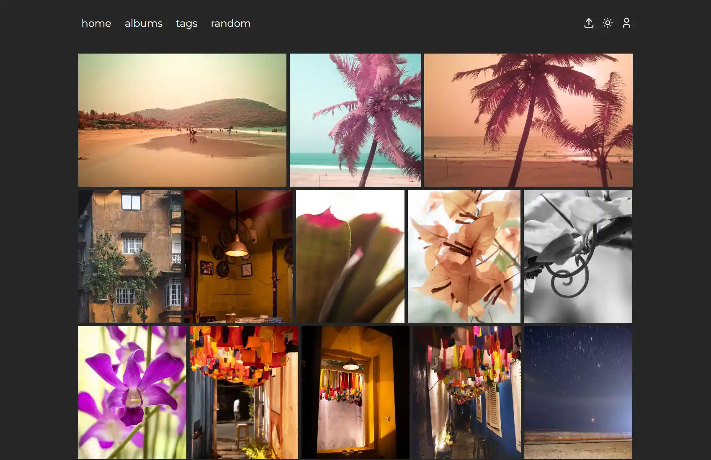
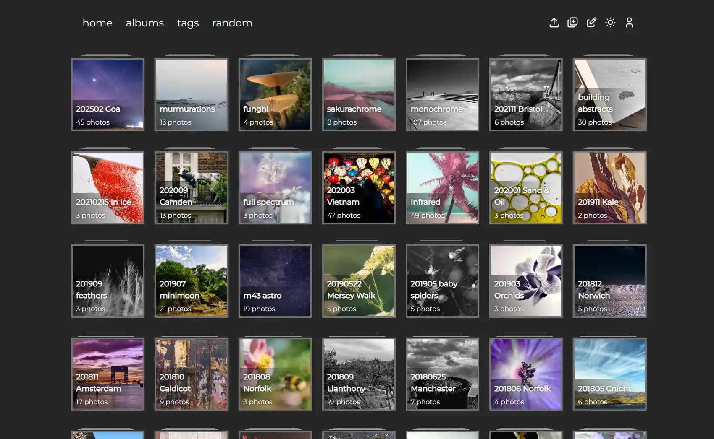
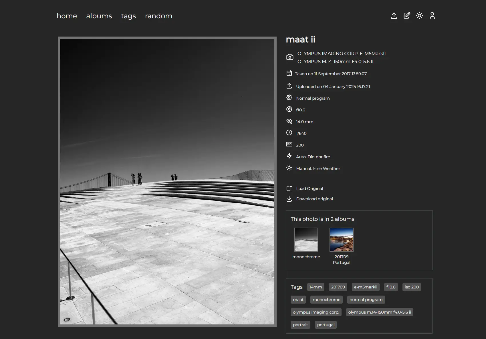

[](https://github.com/uvmain/gallery/actions/workflows/sast.yml)
&nbsp;
[](https://github.com/uvmain/gallery/actions/workflows/dependency-scan.yml)
&nbsp;
[](https://github.com/uvmain/gallery/actions/workflows/build.yml)
&nbsp;

&nbsp;


# Gallery


## Self hosted photo gallery
### Fast, small, no-nonsense
- Tiny (~11Mb) Docker image
- Light and dark mode toggle
- Automatic EXIF metadata retrieval
- Albums, auto-Tags, authentication for editing mode
- Auto import of existing photos

#### Albums


#### EXIF


## Stack
- Go backend
- Vue.js frontend
- SQLite database
- Basic single-user authentication with cookies

## Quick Setup
- create a `.env` file using `.env.example` as a guide
- copy the `docker-compose.yml` file into the same directory, and update the volume binds as required
- `docker compose up -d` to pull the image and run the container in the background

### example
> .env
```
THUMBNAIL_MAX_PIXELS=500
OPTIMISED_MAX_PIXELS=1280
ADMIN_USER=admin
ADMIN_PASSWORD=password
IMAGE_PATH=/mnt/nas/photography
```
> docker-compose.yml
```
services:
  gallery:
    image: uvmain/gallery:latest
    container_name: gallery
    env_file:
      - .env
    volumes:
      - /mnt/main/docker/gallery:/data
      - /mnt/nas/photography:/images
    ports:
      - "3001:8080"
```
> docker compose up -d

## Local Development: Prerequisites
- Go (tested on 1.25.5)
- Node.js & npm (tested on Node 24)

## Local Development: Getting started
1. **Clone the repository:**

```bash
git clone https://github.com/uvmain/gallery
cd gallery
```

2. **Install dependencies:**
```bash
npm install && npm run setup
```
This command downloads the npm dependencies for the local dev and frontend components, and the go dependencies for the backend.

3. **Set up environment variables:**
Update the following environment variables in the .env file:
```bash
IMAGE_PATH=path/to/your/images # defaults to "./images"
ADMIN_USER=your_admin_name # defaults to "admin"
ADMIN_PASSWORD=your_admin_password # defaults to "admin"
```

4. **Start development environment::**
```bash
npm run dev
```
This command:
- Starts the Caddy server for reverse proxy
- Runs the frontend in development mode (MHR)
- Runs the backend in development mode

Open [gallery.localhost](https://gallery.localhost) in your browser

## Scripts
- `npm run backend:dev` - Runs the Go backend in development mode.
- `npm run frontend:dev` - Runs the frontend in development mode.
- `npm run dev` - Starts Caddy and concurrently runs the frontend and backend.
- `npm run build` - Builds both the backend and frontend for production.
- `npm run create-cert` - Generates and installs certificates for local SSL.

## Deployment
```
docker build -t gallery:latest . && docker compose up -d
```

## Contributing
Feel free to submit issues or pull requests for improvements.

## License
This project is licensed under the MIT License.